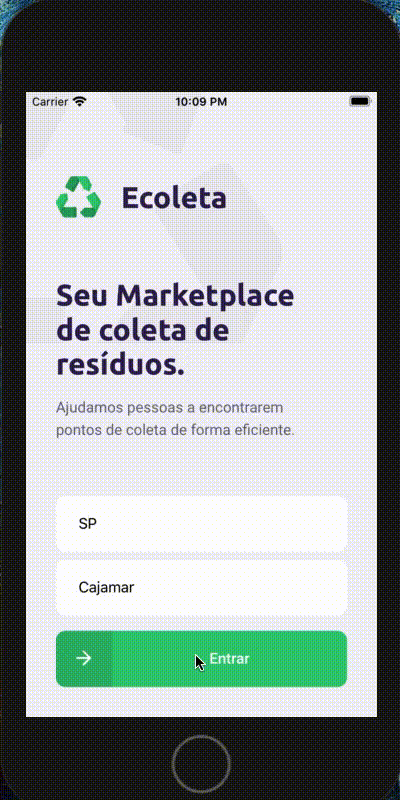

##Ecoleta
###Projeto desenvolvido na "Next level week 1 - booster" onde foi desenvolvido com React, React Native e Node.
##Principais Conteúdos trabalhados
<ul>
    <li>Criação e utilização de API's Rest com Express</li>
    <li>Typescript</li>
    <li>Upload de arquivos com Multer</li>
    <li>Validação de dados com Celebrate(Joi)</li>
    <li>Abstração de Querys com Knex</li>
    <li>Lib de Maps com leaflet e react-native-maps</li>
</ul>
##Demo
###APP

###Site
